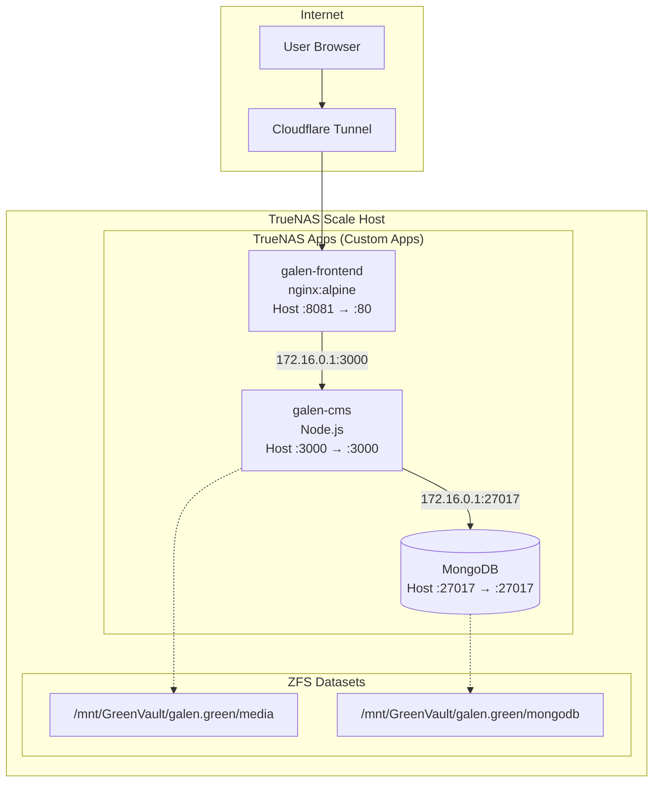
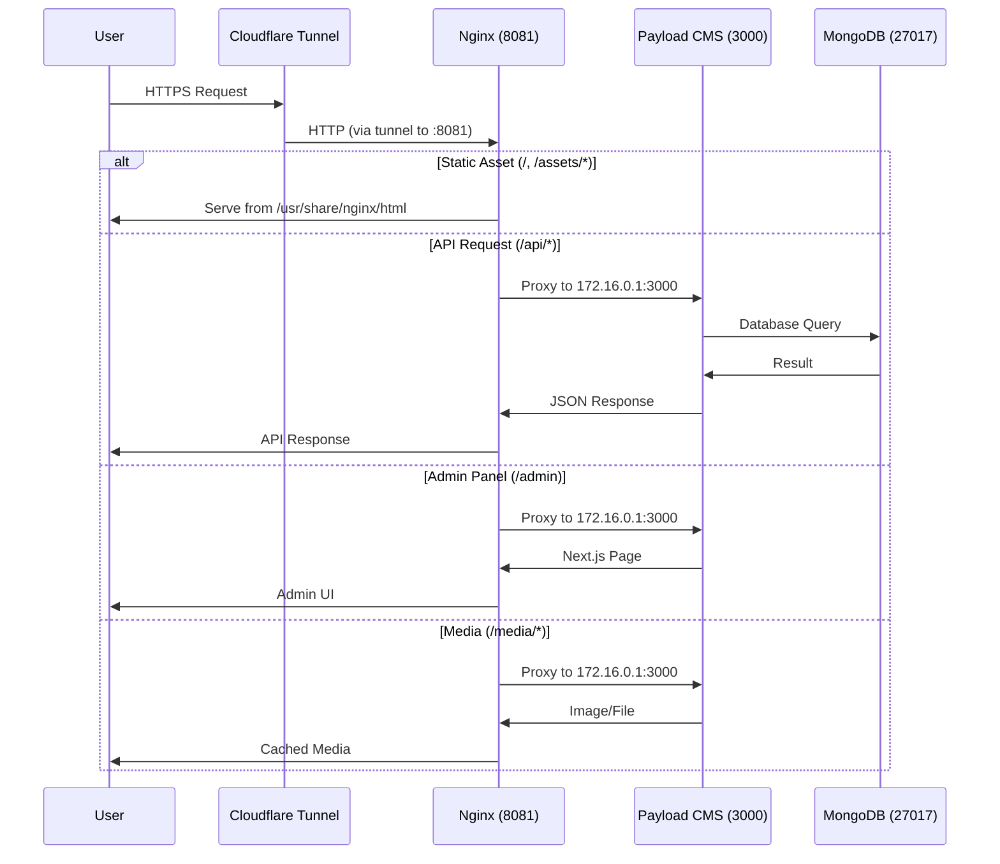
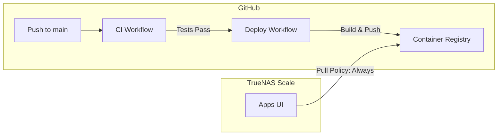
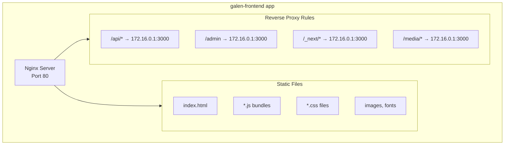
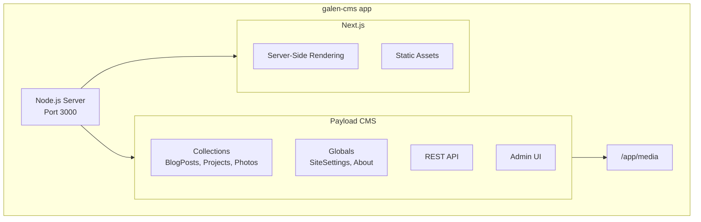
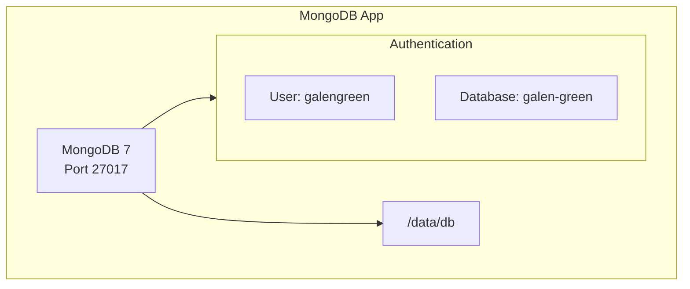
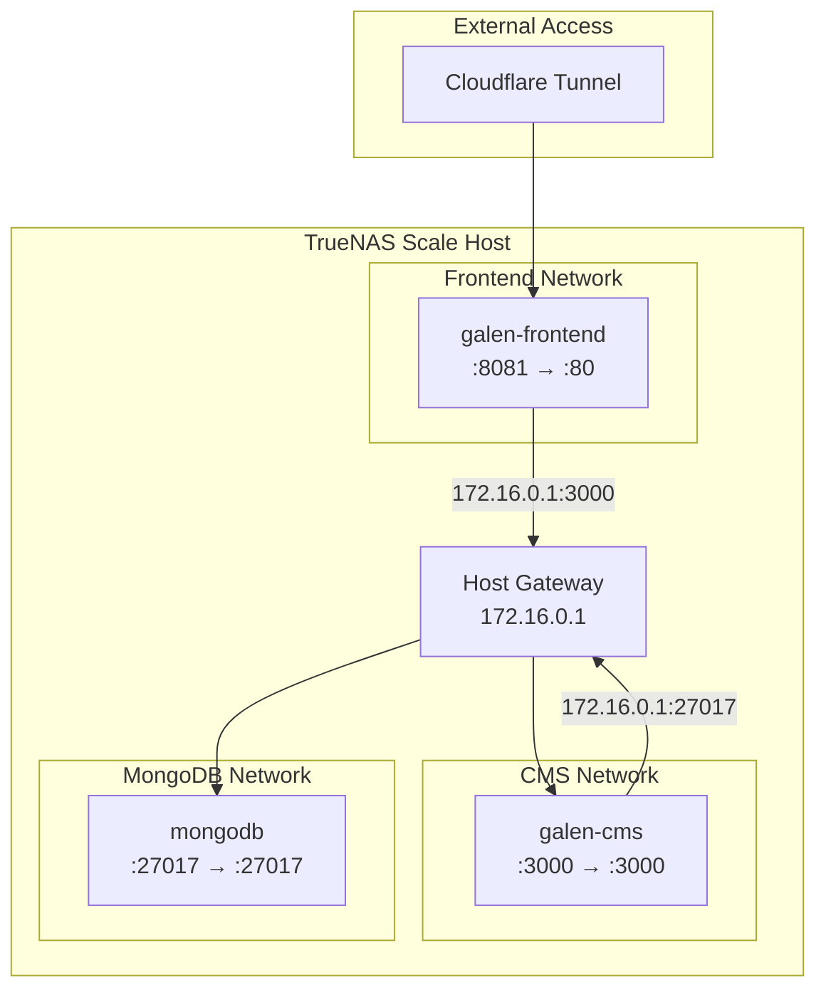
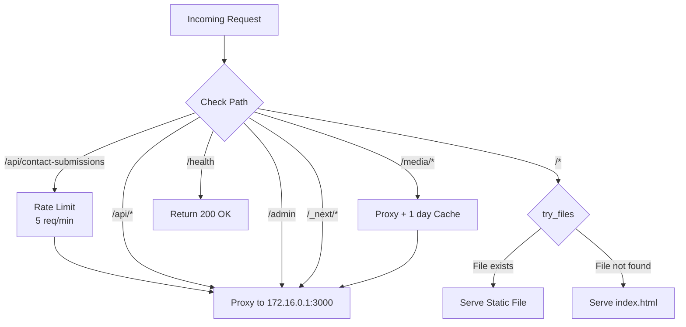

# System Architecture

This document describes the architecture of the galen.green hosting infrastructure.

## High-Level Overview



## Deployment Model

The production environment uses **TrueNAS Scale Apps UI** (Custom Apps), not Docker Compose. Each container runs as an independent app:

| App Name         | Image                                    | Host Port | Container Port |
| ---------------- | ---------------------------------------- | --------- | -------------- |
| `galen-frontend` | `ghcr.io/galengreen/galen-frontend:latest` | 8081      | 80             |
| `galen-cms`      | `ghcr.io/galengreen/galen-cms:latest`      | 3000      | 3000           |
| `mongodb`        | `mongo:7` (or TrueNAS MongoDB app)         | 27017     | 27017          |

**Inter-container communication** uses the host gateway IP `172.16.0.1` rather than Docker DNS, since TrueNAS Apps run on isolated networks.

## Request Flow



## CI/CD Pipeline



**Note**: TrueNAS Apps with "Always pull" policy will fetch the latest image on container restart. There's no Watchtower - you manually restart apps or use TrueNAS scheduled tasks.

## Component Details

### Frontend Container (`galen-frontend`)



**Configuration**:
- Image: `ghcr.io/galengreen/galen-frontend:latest`
- Pull Policy: Always
- Host Port: 8081 → Container Port: 80
- Timezone: Pacific/Auckland
- Restart Policy: No (managed by TrueNAS)
- Resource Limits: 2 CPUs, 4096 MB RAM

**Build Process (Dockerfile)**:
1. Stage 1 (`node:22-alpine`): Install deps, run `npm run build`
2. Stage 2 (`nginx:alpine`): Copy built assets + nginx config

### CMS Container (`galen-cms`)



**Configuration**:
- Image: `ghcr.io/galengreen/galen-cms:latest`
- Pull Policy: Always
- Host Port: 3000 → Container Port: 3000
- Timezone: Pacific/Auckland
- Restart Policy: Unless Stopped
- Resource Limits: 2 CPUs, 4096 MB RAM
- Storage: Host path `/mnt/GreenVault/galen.green/media` → `/app/media`

**Build Process (cms/Dockerfile)**:
1. Stage 1 (`node:22-alpine`): Install deps, generate importmap, build Next.js standalone
2. Stage 2 (`node:22-alpine`): Copy standalone output, run as non-root user

### Database (MongoDB)



**Connection String Format**:
```
mongodb://galengreen:<password>@172.16.0.1:27017/galen-green?authSource=admin
```

## Network Architecture



**Key Points**:
- Each TrueNAS app runs in its own isolated network
- Containers cannot resolve each other by hostname
- All inter-app communication uses `172.16.0.1` (host gateway)
- Ports must be published to the host for apps to communicate

## Nginx Routing



## Storage Persistence

| App              | Mount Path     | Host Path                              | Purpose                   |
| ---------------- | -------------- | -------------------------------------- | ------------------------- |
| `galen-cms`      | `/app/media`   | `/mnt/GreenVault/galen.green/media`    | Uploaded images and files |
| `mongodb`        | `/data/db`     | `/mnt/GreenVault/galen.green/mongodb`  | Database files            |

Both paths are on ZFS datasets, providing:
- Automatic snapshots (if configured)
- Data integrity via checksums
- Easy backup/restore
