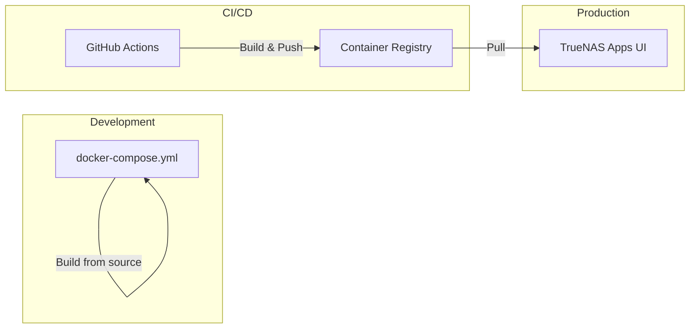

# Deployment Guide

This document covers deployment procedures for galen.green.

## Deployment Model

Production uses **TrueNAS Scale Apps UI** with custom apps. Local development uses Docker Compose.



## Production Deployment (TrueNAS Scale)

### Automatic Updates

1. Push code to the `main` branch
2. GitHub Actions runs tests (lint, type-check, unit tests)
3. If tests pass, Docker images are built and pushed to GHCR with `:latest` tag
4. Restart the apps in TrueNAS to pull the new images

**To trigger an update**:
1. Go to TrueNAS Apps UI
2. Click on the app (e.g., `galen-frontend`)
3. Click "Restart" - this pulls the latest image (Pull Policy: Always)

### Manual App Configuration

#### galen-frontend

| Setting            | Value                                      |
| ------------------ | ------------------------------------------ |
| Image Repository   | `ghcr.io/galengreen/galen-frontend`        |
| Image Tag          | `latest`                                   |
| Pull Policy        | Always                                     |
| Host Port          | 8081                                       |
| Container Port     | 80                                         |
| Timezone           | Pacific/Auckland                           |
| Restart Policy     | No                                         |
| CPU Limit          | 2                                          |
| Memory Limit       | 4096 MB                                    |

No environment variables or storage required.

#### galen-cms

| Setting            | Value                                      |
| ------------------ | ------------------------------------------ |
| Image Repository   | `ghcr.io/galengreen/galen-cms`             |
| Image Tag          | `latest`                                   |
| Pull Policy        | Always                                     |
| Host Port          | 3000                                       |
| Container Port     | 3000                                       |
| Timezone           | Pacific/Auckland                           |
| Restart Policy     | Unless Stopped                             |
| CPU Limit          | 2                                          |
| Memory Limit       | 4096 MB                                    |

**Storage**:
| Type      | Mount Path    | Host Path                              |
| --------- | ------------- | -------------------------------------- |
| Host Path | `/app/media`  | `/mnt/GreenVault/galen.green/media`    |

**Environment Variables**: See [ENVIRONMENT.md](./ENVIRONMENT.md)

#### MongoDB

Use the TrueNAS MongoDB app or a custom app with `mongo:7` image.

| Setting            | Value                                      |
| ------------------ | ------------------------------------------ |
| Image              | `mongo:7`                                  |
| Host Port          | 27017                                      |
| Container Port     | 27017                                      |

**Storage**:
| Type      | Mount Path    | Host Path                              |
| --------- | ------------- | -------------------------------------- |
| Host Path | `/data/db`    | `/mnt/GreenVault/galen.green/mongodb`  |

### Cloudflare Tunnel

The Cloudflare Tunnel routes external traffic to the frontend:

```
https://galen.green → Cloudflare Tunnel → TrueNAS:8081 (frontend nginx)
```

Configure in Cloudflare Zero Trust dashboard:
- Public hostname: `galen.green`
- Service: `http://localhost:8081` (or TrueNAS IP)

## Local Development

### Option 1: Full Docker Stack

```sh
# Start all services (MongoDB, CMS, Frontend)
docker-compose up -d

# View logs
docker-compose logs -f

# Stop services
docker-compose down
```

This builds images from source and runs everything locally.

### Option 2: Vite Dev Server with Remote CMS

For faster frontend development against the production CMS:

```sh
# Create .env file pointing to remote CMS
echo "VITE_PAYLOAD_URL=https://galen.green" > .env

# Start Vite dev server
npm run dev
```

The remote CMS must have `DEV_FRONTEND_URL` set to allow CORS from your local machine:
```
DEV_FRONTEND_URL=http://localhost:5173,http://127.0.0.1:5173,http://100.89.52.22:5173
```

### Option 3: Local CMS Only

```sh
# Terminal 1: Start MongoDB
docker run -d --name mongodb -p 27017:27017 mongo:7

# Terminal 2: Start CMS
cd cms
cp .env.example .env  # Edit with local values
npm run dev

# Terminal 3: Start frontend
npm run dev
```

## Building Images Locally

### Frontend

```sh
# Build the image
docker build -t galen-frontend:local .

# Test locally
docker run -p 8081:80 galen-frontend:local
```

### CMS

```sh
# Build the image (requires build args for Payload)
docker build \
  --build-arg MONGODB_URI=mongodb://localhost:27017/build \
  --build-arg PAYLOAD_SECRET=build-secret \
  -t galen-cms:local \
  ./cms

# Test locally (requires MongoDB)
docker run -p 3000:3000 \
  -e MONGODB_URI=mongodb://host.docker.internal:27017/galen-green \
  -e PAYLOAD_SECRET=your-secret \
  galen-cms:local
```

## Rollback Procedures

### Using Specific Image Tag

Images are tagged with both `:latest` and `:<git-sha>`. To rollback:

```sh
# Find the SHA of the last working commit
git log --oneline

# In TrueNAS Apps UI:
# 1. Edit the app
# 2. Change Image Tag from "latest" to the specific SHA
# 3. Save and restart
```

### Temporary Fix

For urgent fixes, you can SSH into TrueNAS and run:

```sh
# Pull specific version
docker pull ghcr.io/galengreen/galen-frontend:<sha>

# Find and stop the running container
docker ps | grep galen-frontend
docker stop <container-id>

# Run the specific version manually
docker run -d --name galen-frontend-temp \
  -p 8081:80 \
  ghcr.io/galengreen/galen-frontend:<sha>
```

Then fix the issue in code and push to restore normal deployment.

## Health Checks

### Frontend

```sh
curl http://localhost:8081/health
# Returns: OK
```

### CMS

```sh
curl http://localhost:3000/api/health
# Returns: JSON with status
```

### MongoDB

```sh
mongosh "mongodb://galengreen:<password>@localhost:27017/galen-green?authSource=admin" \
  --eval "db.adminCommand('ping')"
```

## Troubleshooting

### 502 Bad Gateway on /api or /admin

1. Check if CMS container is running in TrueNAS Apps UI

2. Verify CMS is accessible from frontend network:
   ```sh
   # SSH into TrueNAS
   curl http://172.16.0.1:3000/api/health
   ```

3. Check nginx config is using correct IP (should be `172.16.0.1`)

4. Check CMS logs in TrueNAS Apps UI

### CMS Can't Connect to MongoDB

1. Verify MongoDB is running in TrueNAS Apps UI

2. Test connection:
   ```sh
   mongosh "mongodb://galengreen:<password>@172.16.0.1:27017/galen-green?authSource=admin"
   ```

3. Check `MONGODB_URI` environment variable format:
   - Password must be URL-encoded (special chars like `$` become `%24`)
   - Must include `?authSource=admin`

### Images Not Updating

1. Verify Pull Policy is set to "Always"

2. Check GitHub Actions completed successfully

3. Manually pull to verify image exists:
   ```sh
   docker pull ghcr.io/galengreen/galen-frontend:latest
   ```

4. Restart the app in TrueNAS Apps UI

### Media Files Missing

1. Check storage mount in TrueNAS app config

2. Verify host path exists:
   ```sh
   ls -la /mnt/GreenVault/galen.green/media
   ```

3. Check permissions on the directory

### CORS Errors in Development

1. Ensure `DEV_FRONTEND_URL` includes your local URL
2. Restart the CMS app after changing environment variables
3. Clear browser cache and try again
