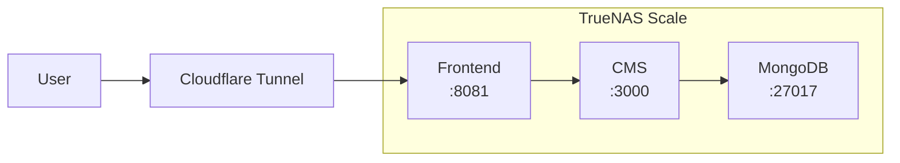

# Hosting Overview

This document provides an overview of the hosting infrastructure for galen.green.

## Quick Reference

| Component    | Technology               | Location                                   |
| ------------ | ------------------------ | ------------------------------------------ |
| Frontend     | Vue 3 + Nginx            | `ghcr.io/galengreen/galen-frontend:latest` |
| CMS          | Payload CMS + Next.js    | `ghcr.io/galengreen/galen-cms:latest`      |
| Database     | MongoDB 7                | TrueNAS MongoDB App                        |
| Host         | TrueNAS Scale            | Self-hosted (Apps UI)                      |
| Registry     | GitHub Container Registry | ghcr.io                                   |
| CDN/Tunnel   | Cloudflare Tunnel        | Edge access to :8081                       |

## URLs

| URL                          | Service                    |
| ---------------------------- | -------------------------- |
| https://galen.green          | Production Site            |
| https://galen.green/admin    | CMS Admin Panel            |
| https://galen.green/api/*    | API Endpoints              |

## Architecture Summary



**Deployment Model**: TrueNAS Scale Apps UI (Custom Apps)
- Each service runs as an independent app
- Communication via host gateway IP (`172.16.0.1`)
- No Docker Compose in production

## Documentation Index

| Document                             | Description                                |
| ------------------------------------ | ------------------------------------------ |
| [ARCHITECTURE.md](./ARCHITECTURE.md) | System architecture and mermaid diagrams   |
| [DEPLOYMENT.md](./DEPLOYMENT.md)     | Deployment procedures and troubleshooting  |
| [ENVIRONMENT.md](./ENVIRONMENT.md)   | Environment variables reference            |
| [HOSTING_AUDIT.md](./HOSTING_AUDIT.md) | Security audit and recommendations       |

## Deployment Flow

1. **Push to main** - Developer pushes code to GitHub
2. **CI/CD** - GitHub Actions runs tests, builds Docker images
3. **Registry** - Images pushed to GHCR with `:latest` and `:<sha>` tags
4. **Update** - Restart apps in TrueNAS to pull new images

## Key Files

```
.
├── Dockerfile                    # Frontend Docker build
├── docker-compose.yml            # Local development only
├── nginx/default.conf            # Nginx reverse proxy config
├── cms/
│   └── Dockerfile                # CMS Docker build
└── .github/workflows/
    ├── ci.yml                    # Test pipeline
    └── deploy.yml                # Build and push images
```

## TrueNAS Apps Configuration

| App              | Image                              | Host Port | Storage                                  |
| ---------------- | ---------------------------------- | --------- | ---------------------------------------- |
| galen-frontend   | ghcr.io/galengreen/galen-frontend  | 8081      | None                                     |
| galen-cms        | ghcr.io/galengreen/galen-cms       | 3000      | /mnt/GreenVault/galen.green/media        |
| mongodb          | mongo:7                            | 27017     | /mnt/GreenVault/galen.green/mongodb      |

## Quick Commands

```sh
# Local development (full stack)
docker-compose up -d

# Local development (frontend only, remote CMS)
echo "VITE_PAYLOAD_URL=https://galen.green" > .env
npm run dev

# Build frontend image locally
docker build -t galen-frontend:local .

# Build CMS image locally
docker build --build-arg MONGODB_URI=mongodb://localhost:27017/build \
  --build-arg PAYLOAD_SECRET=build-secret \
  -t galen-cms:local ./cms
```
